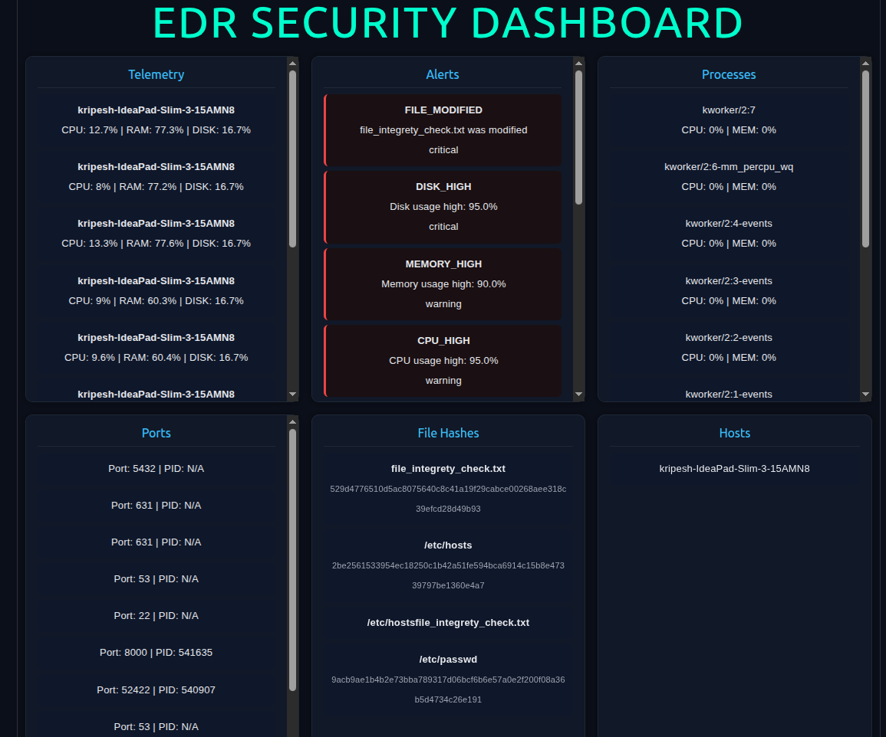
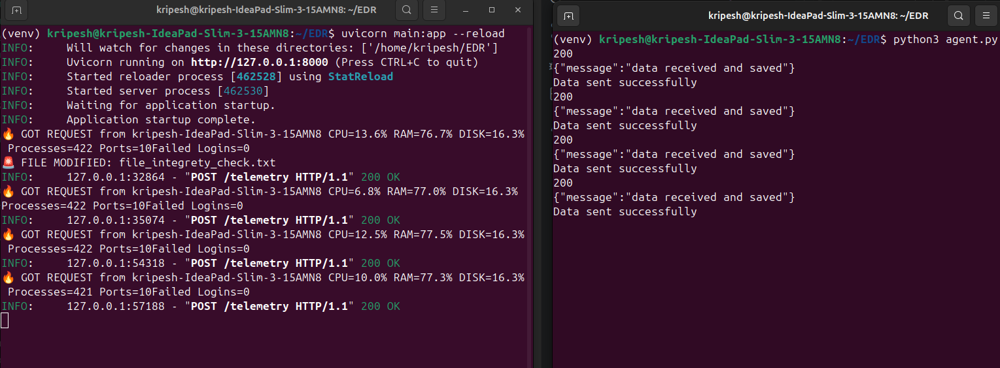
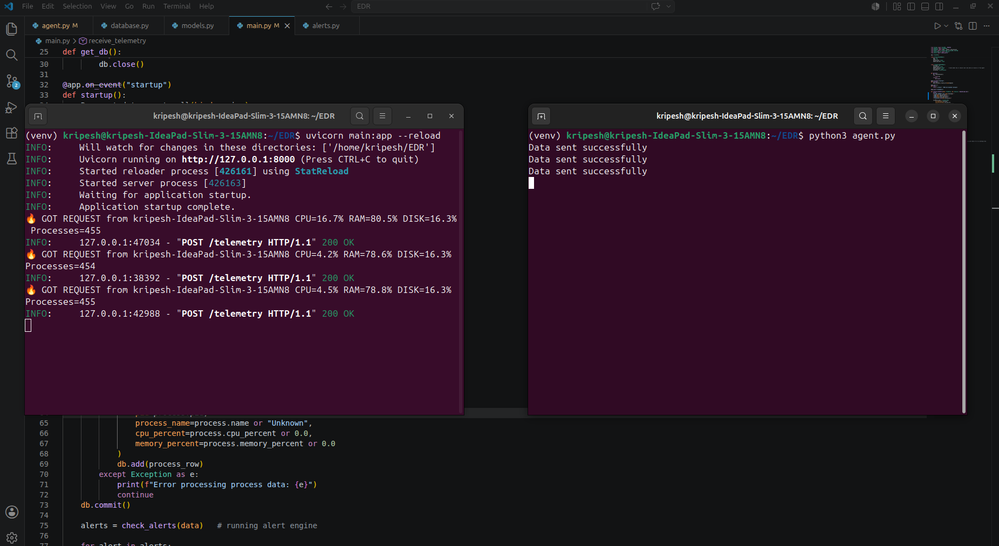
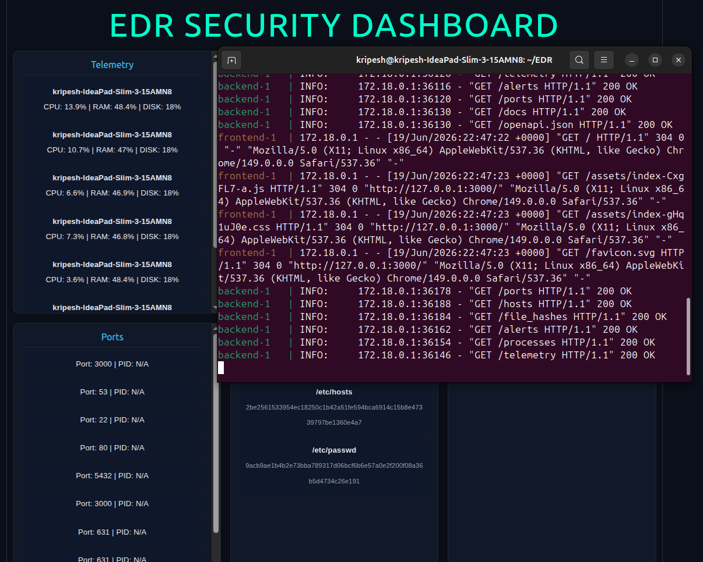

# 🛡️ EDR Lite – Endpoint Detection & Response System

A lightweight **Endpoint Detection & Response (EDR)** system built using **FastAPI, React, PostgreSQL, and Docker**.

This project simulates a real-world security monitoring pipeline that collects endpoint telemetry, detects basic anomalies, and visualizes system activity through a centralized dashboard.

---

# 🚀 Key Features

## 🖥️ System Monitoring
✔ CPU usage tracking  
✔ Memory usage tracking  
✔ Disk usage tracking  
✔ Process monitoring  
✔ Port monitoring  

---

## 🔐 Security Monitoring
✔ File integrity monitoring (hash-based detection)  
✔ Failed login tracking  
✔ Basic security alert generation system  

---

## 📡 Data Pipeline
✔ Real-time telemetry ingestion pipeline  
✔ Agent → API → Database → Dashboard architecture  

---

# 🧠 Architecture

```text id="arch1"
[ Agent ]
   ↓
[ FastAPI Backend ]
   ↓
[ PostgreSQL Database ]
   ↓
[ React Dashboard ]


# Deployment (Dockerized)

The system is fully containerized using Docker Compose.

### Services included:
- PostgreSQL database container  
- FastAPI backend container  
- React frontend served via Nginx  

### Run the project
```bash
docker compose up --build
```

---

# Access

- **Dashboard:** http://localhost:3000  
- **API Docs:** http://localhost:8000/docs  

---

# System Overview

## Backend API Status
FastAPI is running successfully and connected to the database.

## Dockerized Infrastructure
All services run together using Docker Compose:
- Backend API  
- Frontend UI  
- PostgreSQL Database  

## Security & Telemetry Dashboard

Real-time visualization includes:
- System performance metrics  
- Active processes  
- Endpoint telemetry data  

**Data Flow:**  
Agent → Backend → Database → UI  

---

# Current Limitations

- No real-time WebSocket streaming (polling-based updates)  
- Agent requires manual execution  
- Basic authentication layer (minimal JWT implementation)  
- No advanced threat detection or ML-based anomaly detection  

---

# Future Improvements

- Real-time WebSocket-based dashboard updates  
- Background agent service (systemd / Docker agent)  
- Advanced anomaly detection engine  
- Role-based access control (RBAC)  
- Cloud deployment (AWS / GCP)  

---

# Project Structure

```
EDR/
├── backend/
├── dashboard/
├── screenshots/
└── docker-compose.yml
```
## Screenshots

   ### System Dashboard
   

   ### Alert Detection in Action
   

   ### Backend Telemetry Collection
   

   ### Full Stack Running
   
---


## Quick Start

```bash
   git clone https://github.com/KripeshKhatiwada/EDR.git
   cd EDR
   docker-compose up --build
```
   
   - Dashboard: http://localhost:3000
   - API Docs: http://localhost:8000/docs
   - Run agent on another terminal: python agent.py

   
# Author

Built by **Kripesh Khatiwada**  
Cybersecurity | Blue Team | Endpoint Detection Systems